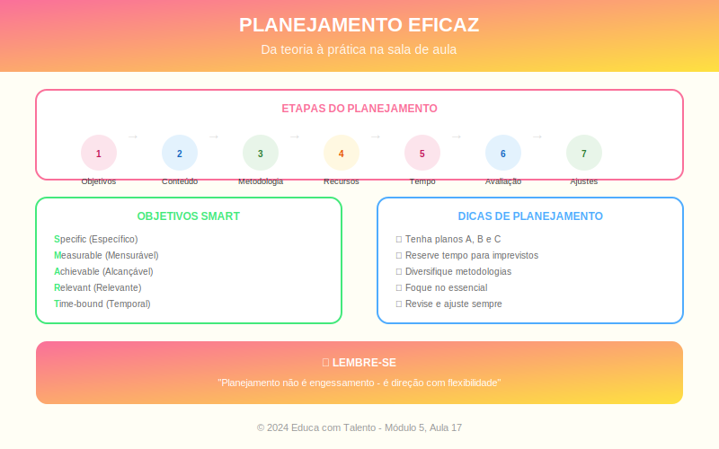

# Aula 17: Planejamento Eficaz de Aulas e Sequências Didáticas

## Informações da Aula

| Item | Descrição |
|------|-----------|
| **Módulo** | 5 - Implementação e Avaliação |
| **Bloco** | Fundamentos |
| **Duração Estimada** | 55 minutos |
| **Nível** | Avançado |

---

## Fundamentação Teórica

### A Importância do Planejamento

**Não planejar é planejar o fracasso**. Pesquisas mostram que a qualidade do planejamento é um dos principais fatores que distinguem professores eficazes.

**Grant Wiggins** e **Jay McTighe**, autores de "Understanding by Design", argumentam:

> "O planejamento mais eficaz é aquele que começa pelo fim: o que queremos que os alunos compreendam, saibam e sejam capazes de fazer?"

### Design Reverso (Backward Design)

Wiggins e McTighe propõem o **Design Reverso** em três estágios:

**Estágio 1: Identificar Resultados Desejados**
- O que os alunos devem saber e saber fazer?
- Quais compreensões duradouras devem desenvolver?
- Que perguntas essenciais guiarão a investigação?

**Estágio 2: Determinar Evidências de Aprendizagem**
- Como saberei se os alunos aprenderam?
- Que evidências coletarei?
- Quais são os critérios de sucesso?

**Estágio 3: Planejar Experiências de Aprendizagem**
- Que atividades levarão aos resultados desejados?
- Que recursos serão necessários?
- Como sequenciar as experiências?

### Elementos de um Plano de Aula

| Elemento | Descrição | Perguntas-Guia |
|----------|-----------|----------------|
| **Objetivos** | O que os alunos aprenderão | O que devem saber/fazer ao final? |
| **Conhecimentos prévios** | O que já sabem | Que base é necessária? |
| **Conteúdo** | O que será trabalhado | Quais conceitos/habilidades? |
| **Metodologia** | Como será trabalhado | Que abordagem(ns) usar? |
| **Recursos** | Com que apoio | Que materiais/tecnologia? |
| **Tempo** | Quanto tempo | Quanto para cada etapa? |
| **Avaliação** | Como verificar | Como saberei se aprenderam? |

### Sequências Didáticas

**Antoni Zabala** define sequência didática como "um conjunto de atividades ordenadas, estruturadas e articuladas para a realização de objetivos educacionais".

**Componentes:**
1. Atividade de abertura (engajar, ativar prévios)
2. Atividades de desenvolvimento (construir conhecimento)
3. Atividades de consolidação (praticar, aplicar)
4. Atividade de fechamento (sintetizar, avaliar)

### Articulação entre Aulas

Uma aula não existe isolada. O planejamento eficaz considera:
- **Conexão com aula anterior**: Retomada, continuidade
- **Progressão**: Do simples ao complexo
- **Conexão com próxima aula**: Gancho, preparação
- **Integração**: Com outras disciplinas quando pertinente

### O Modelo WHERETO

Wiggins e McTighe propõem o acrônimo **WHERETO** para sequenciamento:

| Letra | Significado | Aplicação |
|-------|-------------|-----------|
| **W** | Where/Why | Para onde vamos? Por que isso importa? |
| **H** | Hook/Hold | Gancho para engajar; manter interesse |
| **E** | Explore/Equip | Explorar; equipar com conhecimento/habilidades |
| **R** | Rethink/Reflect | Repensar; refletir sobre o aprendizado |
| **E** | Evaluate | Avaliar (formativa e sumativamente) |
| **T** | Tailor | Adaptar às necessidades individuais |
| **O** | Organize | Organizar para máximo engajamento |

### Flexibilidade no Planejamento

O plano é um guia, não uma prisão. **Donald Schön** nos lembra que o professor reflexivo adapta em tempo real.

**Sinais de que precisa adaptar:**
- Alunos não estão entendendo
- Terminaram muito antes do previsto
- Uma discussão interessante surgiu
- Questão inesperada foi levantada

**Ter Plano B:**
- Atividades extras se sobrar tempo
- Simplificação se faltar tempo
- Alternativas se tecnologia falhar

---

## Objetivos de Aprendizagem

Ao final desta aula, o educador será capaz de:

1. **Aplicar** os princípios do Design Reverso no planejamento
2. **Estruturar** planos de aula com todos os elementos essenciais
3. **Desenvolver** sequências didáticas articuladas
4. **Utilizar** o modelo WHERETO para sequenciamento
5. **Equilibrar** planejamento estruturado com flexibilidade

---

## Atividade Prática

### Planejamento Completo

1. Escolha uma unidade de sua disciplina (2-3 semanas)

2. Aplique o **Design Reverso**:
   - Estágio 1: Liste os resultados desejados
   - Estágio 2: Descreva as evidências de aprendizagem
   - Estágio 3: Esboce as experiências de aprendizagem

3. Desenvolva **um plano de aula detalhado** para a primeira aula da sequência

4. Verifique se seu plano atende ao **WHERETO**

5. Identifique **2 situações** que podem exigir adaptação e seu Plano B

**Entrega**: Design Reverso da unidade + Plano de aula detalhado

---

## Conclusão

### Pontos-Chave
- Planejamento eficaz começa pelo fim (Design Reverso)
- Três estágios: resultados, evidências, experiências
- Sequências didáticas articulam múltiplas aulas
- WHERETO orienta o sequenciamento
- Flexibilidade é tão importante quanto estrutura

### Frase de Encerramento
> "Planejamento não é prever o futuro, mas preparar-se para ele."
> — Adaptado de **Peter Drucker**

---

*Aula 17 de 20 - Curso Metodologias de Ensino - Educa com Talento*

