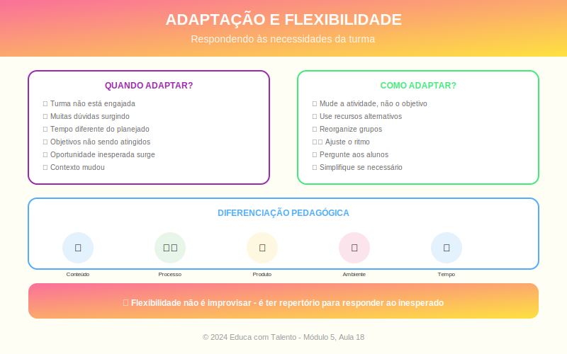

# Aula 18: Adaptação e Flexibilidade na Implementação

## Informações da Aula

| Item | Descrição |
|------|-----------|
| **Módulo** | 5 - Implementação e Avaliação |
| **Bloco** | Implementação |
| **Duração Estimada** | 50 minutos |
| **Nível** | Avançado |

---

## Fundamentação Teórica

### O Planejamento Encontra a Realidade

Por mais bem planejada que seja uma aula, a realidade da sala de aula é **imprevisível**. Alunos fazem perguntas inesperadas, a tecnologia falha, conflitos surgem, o tempo não é suficiente.

**Lee Shulman**, da Universidade de Stanford, chama a docência de "a profissão mais complexa do mundo" porque exige tomar centenas de decisões por hora, muitas em frações de segundo.

### Reflexão-na-Ação: Donald Schön

**Schön** distinguiu três níveis de reflexão:

| Nível | Quando Acontece | Exemplo |
|-------|-----------------|---------|
| **Reflexão-na-ação** | Durante a ação | Percebo que alunos não entenderam e mudo a abordagem |
| **Reflexão-sobre-a-ação** | Após a ação | Analiso o que funcionou e o que não funcionou |
| **Reflexão-sobre-reflexão-na-ação** | Meta-reflexão | Reflito sobre como reflito e tomo decisões |

### Indicadores para Adaptação

**Sinais de que algo não está funcionando:**
- Olhares confusos
- Perguntas repetidas sobre o básico
- Silêncio quando se espera participação
- Agitação ou dispersão
- Respostas muito fora do esperado

**Sinais de que pode acelerar:**
- Respostas corretas imediatas
- Alunos terminando muito rápido
- Pedidos por mais desafio
- Conversas paralelas por tédio

### Estratégias de Adaptação

#### Quando a compreensão está baixa:
- Retomar com outra abordagem/exemplo
- Usar mais visual/concreto
- Quebrar em passos menores
- Trabalho em duplas para discussão
- Verificação individual

#### Quando sobra tempo:
- Atividade de aprofundamento
- Aplicação a novo contexto
- Discussão sobre implicações
- Preparação para próxima aula

#### Quando falta tempo:
- Priorizar o essencial
- Adiar parte para próxima aula
- Converter atividade para tarefa
- Síntese rápida dos pontos-chave

#### Quando tecnologia falha:
- Ter Plano B analógico
- Usar dispositivos dos alunos
- Adaptar atividade para papel/quadro
- Não entrar em pânico

### Diferenciação Pedagógica

**Carol Ann Tomlinson** (Universidade de Virginia) é referência em diferenciação:

> "Diferenciação é uma forma de pensar sobre ensino e aprendizagem. É uma filosofia que orienta a prática."

**O que pode ser diferenciado:**
- **Conteúdo**: O que os alunos aprendem
- **Processo**: Como aprendem
- **Produto**: Como demonstram aprendizagem
- **Ambiente**: Condições de aprendizagem

**Estratégias de diferenciação:**
- Estações com níveis diferentes
- Escolha de atividades (menu)
- Grupos flexíveis por nível
- Materiais em diferentes formatos
- Tempo flexível para conclusão

### Gestão de Situações Desafiadoras

| Situação | Estratégia |
|----------|------------|
| **Pergunta que não sei responder** | "Ótima pergunta! Vou pesquisar e trago na próxima aula." |
| **Conflito entre alunos** | Separar, acalmar, resolver depois (não ignorar) |
| **Aluno desafia autoridade** | Não escalar; conversar individualmente depois |
| **Discussão sai do controle** | Retomar estrutura; reconhecer o engajamento |
| **Ninguém participa** | Reformular pergunta; trabalho em duplas primeiro |

### Desenvolvendo a Capacidade de Improviso

**Keith Sawyer** (Universidade de Washington), pesquisador de criatividade, argumenta que bom improviso vem de **preparação profunda**:

- Domínio do conteúdo
- Repertório amplo de estratégias
- Conhecimento dos alunos
- Experiência refletida

---

## Objetivos de Aprendizagem

Ao final desta aula, o educador será capaz de:

1. **Reconhecer** indicadores que sinalizam necessidade de adaptação
2. **Aplicar** estratégias de adaptação para diferentes situações
3. **Diferenciar** ensino para atender diversidade de alunos
4. **Gerenciar** situações desafiadoras mantendo o clima de aprendizagem
5. **Desenvolver** capacidade de reflexão-na-ação

---

## Atividade Prática

### Simulação de Cenários

Para cada cenário abaixo, descreva: (a) como você identificaria o problema, (b) que adaptação faria, (c) o que aprenderia para o futuro.

**Cenário 1:** Você planejou uma atividade colaborativa de 30 minutos, mas após 10 minutos percebe que a maioria dos grupos está perdida.

**Cenário 2:** Você está no meio da explicação de um conceito importante e a internet cai, impedindo o uso do vídeo que seria central.

**Cenário 3:** Uma pergunta de um aluno leva a turma para uma discussão não planejada, mas extremamente rica e conectada ao conteúdo.

**Cenário 4:** Você percebe que 3 alunos já terminaram a atividade enquanto outros ainda estão na metade.

**Entrega**: Análise dos 4 cenários

---

## Conclusão

### Pontos-Chave
- A sala de aula é imprevisível; adaptação é essencial
- Reflexão-na-ação permite ajustes em tempo real
- Indicadores ajudam a identificar quando adaptar
- Diferenciação atende à diversidade
- Improviso eficaz vem de preparação profunda

### Frase de Encerramento
> "Ser flexível não significa ser fraco. Significa ter a força de adaptar-se."
> — Adaptado

---

*Aula 18 de 20 - Curso Metodologias de Ensino - Educa com Talento*

