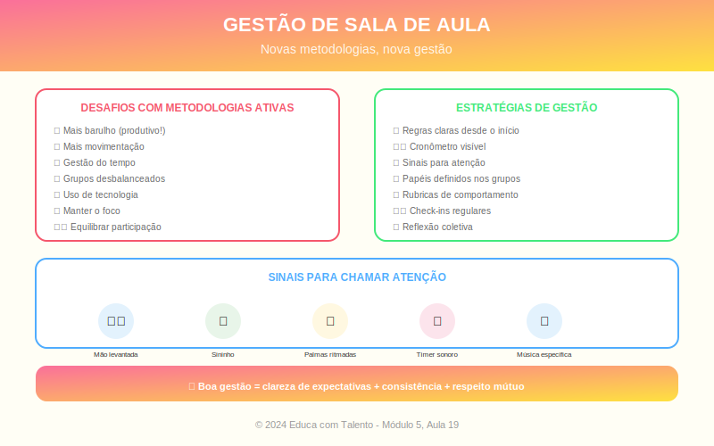

# Aula 19: Gestão de Sala de Aula e Engajamento

## Informações da Aula

| Item | Descrição |
|------|-----------|
| **Módulo** | 5 - Implementação e Avaliação |
| **Bloco** | Gestão |
| **Duração Estimada** | 55 minutos |
| **Nível** | Avançado |

---

## Fundamentação Teórica

### A Importância da Gestão de Sala

**Robert Marzano**, pesquisador educacional, afirma:

> "A gestão eficaz de sala de aula é o pré-requisito para tudo mais que acontece na educação."

Sem gestão eficaz, mesmo as melhores metodologias falham. Com ela, até aulas simples podem ser extraordinárias.

### Os Quatro Componentes de Marzano

Marzano identifica quatro áreas de gestão:

1. **Estabelecimento de regras e procedimentos**
2. **Intervenções disciplinares**
3. **Relação professor-aluno**
4. **Estado mental apropriado**

### Regras vs. Procedimentos

| Regras | Procedimentos |
|--------|---------------|
| Expectativas gerais de comportamento | Formas de fazer as coisas |
| Ex: "Respeitar os colegas" | Ex: "Como entregar tarefas" |
| Poucas (5-7) | Muitos (diversos contextos) |
| Aplicam-se sempre | Aplicam-se em situações específicas |

**Princípios para regras eficazes:**
- Poucas, claras, positivas
- Construídas com os alunos (quando possível)
- Explicar o porquê
- Reforçar consistentemente
- Ter consequências claras e proporcionais

### O Modelo CHAMPS (Sprick)

**Randy Sprick** desenvolveu o modelo **CHAMPS** para clarificar expectativas:

| Letra | Significado | Pergunta |
|-------|-------------|----------|
| **C** | Conversation | Podem conversar? Com quem? Sobre o quê? |
| **H** | Help | Como pedir ajuda? |
| **A** | Activity | Qual é a tarefa? |
| **M** | Movement | Podem se mover? Como? |
| **P** | Participation | Como é a participação esperada? |
| **S** | Success | Como saber se fizeram certo? |

### Técnicas de Gestão (Doug Lemov)

**Lemov** identificou técnicas de professores excepcionais:

| Técnica | Descrição |
|---------|-----------|
| **Strong Voice** | Economia de palavras; registro formal quando necessário |
| **Do It Again** | Se não fez direito, faz de novo (sem raiva) |
| **What to Do** | Dizer O QUE fazer, não apenas o que NÃO fazer |
| **100%** | Expectativa de que todos cumpram |
| **Radar/Be Seen Looking** | Monitorar toda a sala |
| **Circulate** | Mover-se estrategicamente pela sala |
| **Make Compliance Visible** | Pedir demonstração visível de que seguiram instrução |

### Engajamento: A Chave para a Gestão

**Engajamento previne indisciplina**. Quando alunos estão genuinamente envolvidos, comportamentos problemáticos diminuem.

**Phillip Schlechty** distingue níveis de engajamento:

| Nível | Descrição |
|-------|-----------|
| **Engajamento autêntico** | Interesse genuíno; persistência |
| **Engajamento ritual** | Faz para cumprir; sem interesse real |
| **Conformidade passiva** | Presente mas desconectado |
| **Recolhimento** | Desistência; não tenta |
| **Rebeldia** | Resistência ativa |

### Estratégias para Aumentar Engajamento

**Antes da aula:**
- Planejar com variedade
- Conectar com interesses dos alunos
- Criar expectativa/curiosidade

**Durante a aula:**
- Começar com gancho forte
- Variar atividades a cada 10-15 minutos
- Usar movimento físico
- Incorporar escolha
- Fazer perguntas frequentes
- Feedback imediato

**O fator relacionamento:**
- Conhecer os alunos
- Demonstrar interesse genuíno
- Chamar pelo nome
- Celebrar conquistas

### Lidando com Comportamentos Desafiadores

**Escala de intervenção** (menos invasivo para mais invasivo):

1. **Proximidade**: Aproximar-se do aluno
2. **Olhar**: Contato visual significativo
3. **Gesto**: Sinal não-verbal
4. **Menção indireta**: "Alguns ainda estão conversando..."
5. **Menção direta**: "João, preciso que preste atenção."
6. **Consequência anunciada**: "Se continuar, teremos que conversar depois."
7. **Consequência aplicada**: Conversa individual; comunicado aos pais

**Princípios:**
- Preservar dignidade do aluno
- Não escalar emocionalmente
- Consequências lógicas, não punitivas
- Restaurar relação depois

---

## Objetivos de Aprendizagem

Ao final desta aula, o educador será capaz de:

1. **Distinguir** regras de procedimentos e estabelecê-los eficazmente
2. **Aplicar** o modelo CHAMPS para clarificar expectativas
3. **Utilizar** técnicas de gestão de Lemov
4. **Identificar** níveis de engajamento e estratégias para cada um
5. **Aplicar** escala de intervenção para comportamentos desafiadores

---

## Atividade Prática

### Plano de Gestão

1. Liste **5 regras** para sua sala de aula (claras, positivas)

2. Descreva **3 procedimentos** importantes e como os ensinaria

3. Escolha uma atividade comum em suas aulas e aplique o modelo **CHAMPS**

4. Identifique **2 técnicas de Lemov** que você adotará e descreva como as usará

5. Descreva um **comportamento desafiador** que enfrenta e planeje a escala de intervenção

**Entrega**: Plano de gestão completo

---

## Conclusão

### Pontos-Chave
- Gestão eficaz é pré-requisito para aprendizagem
- Regras são diferentes de procedimentos
- CHAMPS clarifica expectativas para cada atividade
- Engajamento previne indisciplina
- Intervenções devem seguir escala, preservando dignidade

### Frase de Encerramento
> "A melhor gestão de sala de aula é aquela que é quase invisível — porque os alunos estão tão engajados que não há nada para 'gerenciar'."
> — Adaptado

---

*Aula 19 de 20 - Curso Metodologias de Ensino - Educa com Talento*

