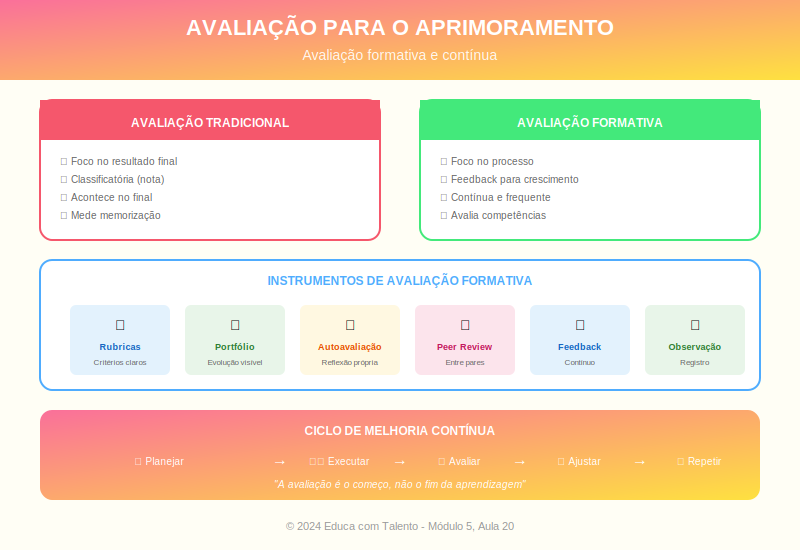

# Aula 20: Avaliação da Prática e Aprimoramento Contínuo

## Informações da Aula

| Item | Descrição |
|------|-----------|
| **Módulo** | 5 - Implementação e Avaliação |
| **Bloco** | Encerramento |
| **Duração Estimada** | 55 minutos |
| **Nível** | Avançado |

---

## Fundamentação Teórica

### O Professor como Eterno Aprendiz

**Paulo Freire** afirmou:

> "Ninguém nasce educador ou marcado para ser educador. A gente se faz educador permanentemente na prática e na reflexão sobre a prática."

O desenvolvimento profissional não termina com a formação inicial — é um processo contínuo de toda a carreira.

### Avaliação Formativa da Prática

Assim como avaliamos alunos formativamente, precisamos avaliar nossa própria prática com regularidade:

**Fontes de feedback:**
| Fonte | O que oferece |
|-------|---------------|
| **Autoavaliação** | Reflexão pessoal sobre o que funcionou |
| **Resultados dos alunos** | Evidência de aprendizagem efetiva |
| **Feedback dos alunos** | Percepção de quem vivencia a aula |
| **Observação de pares** | Olhar externo de colega |
| **Mentoria/coaching** | Acompanhamento profissional |
| **Gravação de aulas** | Ver-se em ação |

### O Ciclo de Melhoria Contínua

**William Edwards Deming** popularizou o ciclo **PDCA**:

| Etapa | Significado | Aplicação Docente |
|-------|-------------|-------------------|
| **P - Plan** | Planejar | Definir o que melhorar e como |
| **D - Do** | Fazer | Implementar a mudança |
| **C - Check** | Verificar | Avaliar resultados |
| **A - Act** | Agir | Ajustar e padronizar (ou recomeçar) |

### Ferramentas de Autoavaliação

#### Diário Reflexivo
Registro regular de:
- O que funcionou bem
- O que não funcionou
- Hipóteses sobre por quê
- O que farei diferente

#### Rubrica de Autoavaliação
Critérios claros sobre diferentes aspectos da prática:
- Planejamento
- Execução
- Avaliação
- Relacionamento
- Gestão

#### Análise de Resultados
Examinar:
- Notas e desempenho dos alunos
- Padrões (quem está tendo dificuldade? Em quê?)
- Comparação ao longo do tempo

### Feedback dos Alunos

**Questões úteis para alunos:**
- O que ajuda você a aprender nesta aula?
- O que dificulta sua aprendizagem?
- O que o professor poderia fazer diferente?
- Em uma escala de 1-10, quão engajado você se sente? Por quê?

**Cuidados:**
- Criar ambiente seguro para honestidade
- Não reagir defensivamente
- Agradecer feedback
- Mostrar que mudanças foram feitas

### Observação de Pares

**Benefícios:**
- Olhar externo identifica pontos cegos
- Troca de práticas entre colegas
- Comunidade de aprendizagem profissional

**Protocolo sugerido:**
1. Pré-observação: Observador sabe o foco
2. Observação: Registro sem julgamento
3. Pós-observação: Conversa reflexiva (perguntas, não prescrições)

### Comunidades de Aprendizagem Profissional (PLCs)

**DuFour et al.** definem PLCs como grupos de educadores que se reúnem regularmente para:
- Colaborar na melhoria do ensino
- Compartilhar práticas
- Analisar dados de aprendizagem
- Apoiar-se mutuamente

**Características:**
- Foco em aprendizagem (não apenas ensino)
- Cultura de colaboração
- Orientação por resultados

### Mentoria e Coaching

**Diferença:**
- **Mentor**: Mais experiente; oferece conselhos; relação hierárquica
- **Coach**: Pode ser par; faz perguntas; ajuda o outro a encontrar respostas

Ambos são valiosos em diferentes momentos.

### Plano de Desenvolvimento Profissional

**Componentes:**
1. **Autoavaliação**: Onde estou?
2. **Metas**: Onde quero chegar?
3. **Ações**: O que farei?
4. **Recursos**: O que preciso?
5. **Prazos**: Quando?
6. **Evidências**: Como saberei que alcancei?

---

## Objetivos de Aprendizagem

Ao final desta aula e do curso, o educador será capaz de:

1. **Valorizar** o desenvolvimento profissional como processo contínuo
2. **Utilizar** diversas fontes de feedback sobre sua prática
3. **Aplicar** o ciclo PDCA para melhoria contínua
4. **Coletar** feedback dos alunos de forma eficaz
5. **Participar** de processos de observação entre pares
6. **Elaborar** um plano de desenvolvimento profissional pessoal

---

## Atividade Prática: Projeto Final do Curso

### Portfólio de Conclusão

**Parte 1: Autoavaliação (30%)**

Reflita sobre sua jornada no curso:
1. O que você sabia/fazia antes do curso em relação a metodologias de ensino?
2. O que mudou em sua compreensão?
3. Que práticas você já implementou ou planeja implementar?
4. Quais seus principais pontos fortes como educador?
5. Quais suas principais oportunidades de desenvolvimento?

**Parte 2: Plano de Desenvolvimento Profissional (40%)**

Elabore um plano para os próximos 12 meses:

| Área | Meta | Ações | Prazo | Evidência |
|------|------|-------|-------|-----------|
| Metodologias | | | | |
| Tecnologia | | | | |
| Socioemocional | | | | |
| Gestão | | | | |

**Parte 3: Compromisso Público (30%)**

Escolha UMA mudança concreta que você se compromete a fazer em sua prática.
- Descreva a mudança
- Explique por que é importante
- Detalhe como vai implementar
- Defina como vai avaliar o impacto

**Formato de entrega:**
- Documento de 4-6 páginas
- Ou apresentação de 10-15 slides
- Ou vídeo de 5-7 minutos

---

## Conclusão do Curso

### Síntese dos 5 Módulos

| Módulo | Tema Central | Principal Aprendizado |
|--------|--------------|----------------------|
| 1 | Fundamentos e Evolução | Teoria e prática são indissociáveis |
| 2 | Metodologias Clássicas | Exposição e questionamento bem feitos são poderosos |
| 3 | Metodologias Ativas | Aluno no centro aumenta engajamento e profundidade |
| 4 | Tecnologia e Socioemocional | Educação integral combina técnica e humanidade |
| 5 | Implementação | Planejamento, adaptação, gestão e melhoria contínua |

### As 10 Principais Lições do Curso

1. **Metodologia é meio**, não fim — serve à aprendizagem
2. **Não há metodologia universalmente superior** — contexto determina escolha
3. **O professor faz a diferença** — mesma metodologia, resultados diferentes
4. **Teoria sem prática é estéril; prática sem teoria é cega**
5. **Conhecer os alunos é pré-requisito** para escolhas metodológicas
6. **Engajamento previne problemas** de gestão
7. **Tecnologia potencializa**, não substitui boas práticas
8. **Competências socioemocionais importam** tanto quanto cognitivas
9. **Flexibilidade é tão importante quanto planejamento**
10. **Desenvolvimento profissional é processo**, não evento

### Frase de Encerramento do Curso

> "Educação não é preparação para a vida; educação é a própria vida. Que sua jornada como educador seja uma vida de aprendizagem contínua, curiosidade permanente e impacto transformador."
> — Inspirado em **John Dewey**

---

## Certificado de Conclusão

Ao concluir este curso e entregar o Projeto Final, você receberá o Certificado de Conclusão do curso **Metodologias de Ensino** (40 horas) emitido pela plataforma **Educa com Talento**.

---

*Aula 20 de 20 - Curso Metodologias de Ensino - Educa com Talento*

*Parabéns por completar o curso! Sua dedicação ao desenvolvimento profissional fará diferença na vida de seus alunos.*

